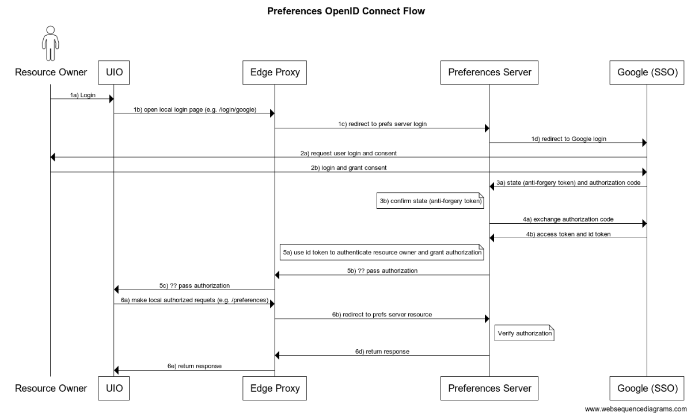

# Preferences Edge Proxy Workflow

A workflow supported by the Personal Data Storage, or Preferences server, where
the user makes save/retrieve requests for their preferences while on a static
site. An example is where a user changes their UI Options (UIO) preferences and
wants to save them.

Included in this workflow is an OAuth2 authorization sequence where
users are authenticated by a third party single sign on (SSO) provider, such as
Google or GitHub.

This document describes the requests, responses, payloads, and database structures
needed to support static access and single sign on workflows.

The examples all assume that the OAuth2 authorization server
is Google.  Google provides an [OAuth 2.0 Playground](https://developers.google.com/oauthplayground/)
where each step of the SSO workflow can be executed in isolation, and where information
about the requests and responses are displayed.  This was used to determine the details
of the SSO process.

## OpenID Connect Workflow



## Actors/Resources

* **Resource Owner**: The user attempting to authorize UIO to use their
  preferences
* **UIO**: An embedded instance of User Interface Options (UI Options)
  preferences editor/enactors
* **Edge Proxy**: Lambda functions, server configuration, or light weight server
  to handle redirects between UIO and the Preferences server. To allow cross origin
  requests.
* **SSO Client**: A client of an SSO provider, where the client uses the
  provider as a way of authenticating users.  The Preferences Server is a client
  in this context.
* **SSO Provider**: An OAuth2 server that is used to authenticate users.  Google is
  an SSO provider.
* **Preferences Server**: An instance of the Personal Data Storage service. Stores
  preferences and authenticates with a single sign on (SSO) provider, e.g. Google.
* **Google SSO**: Using Google as SSO provider. The examples are based on their
  API but others could be substituted.

## Workflow Description

1. Open login
    1. Trigger login to Preferences server from UIO
    2. UIO makes a local request handled by the Edge Proxy. This is to prevent
       cross origin requests. e.g. `/login/google`
    3. The Edge Proxy redirects this request to the proper endpoint on the
       Preferences Server.
2. The Preferences Server sends an [authentication request](https://developers.google.com/identity/protocols/oauth2/openid-connect#sendauthrequest)
   to Google.
   1. the authentication request includes the following as query parameters:
      * `client_id` identifying the Preferences Server to Google
      * `response_type` which is usually `code`
      * `scope` which would likely be `openid email`
      * `redirect_uri` which is the endpoint on the Preferences Server that
           will receive the response from Google. It must match the authorized
           redirect URI that was pre-registered with Google.
      * `state`, the anti-forgery unique session token
   2. Login and consent:  The Resource Owner may be presented with a login
      screen by Google in their domain, and asked to consent the requested
      scope.
      * If the user is already logged into Google, they will be presented
        with the consent dialog.
   3. The Resource Owner authenticates with Google and grants consent
      * If the user has previously provided consent, Google will present no
        dialog, but will retrieve the scope(s) of information for which the user
        has consented.
   4. [Authorization code and anti-forgery](https://developers.google.com/identity/protocols/oauth2/openid-connect#confirmxsrftoken):
      Google responds to the Preferences Server at the `redirect_uri` including:
      * `state` anti-forgery token from step 2i
      * `code` the authentication code provided by Google
      * `scope` the scopes for which the user consented at step 2iii.
   5. The Preferences Server confirms that the `state` (anti-forgery token) is
      valid by checking that it matches the value it sent to Google in step 2i.
   6. [Exchange Authorization Code](https://developers.google.com/identity/protocols/oauth2/openid-connect#exchangecode):
      The Preferences Server requests exchanging the Authorization Code for an
      Access Token and ID Token. This includes the following:
      * `code`, the Authorization Code sent from the previous response from
         Google
      * `client_id` for the Preferences Server (same value as steps 2i)
      * `redirect_uri` which is the endpoint on the Preferences Server that
         will receive the response from Google (same value as step 2i)
      * `grant_type` which must be set to `authorization_code`
   7. Google responds at the previously specified redirect uri with the Access
      Token
      * The `access_token` can be used by the Preferences Server to access the Google API
3. Authenticate and Authorize UIO
   1. The Preferences Server generates a time-limited session key that is associated
      with the authenticated Resource Owner.
   2. The Preferences Server responds to the `/authenticate` request sending the
      session key to the Edge Proxy
   3. The Edge Proxy responds to UIO's `/login/google` request, passing back the session key
4. Making Authorized Requests to the Preferences Server
   1. UIO make a local request to the Preferences Server handled by the Edge Proxy,
      passing the `loginToken` in the `Authorization` header.
   2. The Edge Proxy redirects this request to a Preferences Server
      end point
   3. The Preferences Server validates the `loginToken` authorization.
   4. The Preferences Server responds to the Edge Proxy
   5. The Edge Proxy responds to UIO

## UIO and Edge Proxy Details

This covers steps 1, 3, and 4.

**1i**. Resource Owner interacts with UIO's user interface to log into the
Preferences Server using their Google credentials.

The details of this are left to UIO.

**1ii**. UIO makes a local request handled by the Edge Proxy.

```text
GET /<Edge Proxy>/login/google
```

### Parameters

This request has no parameters, nor payload

**1iii**. The Edge Proxy redirects to the single sign-on endpoint of the
Preferences Server

```text
GET /<Preferences Server>/authenticate
```

### Parameters

| Name    | Type     | Description |
| ---     | ---      | ---         |
| `sso`   | `String` | __Required__. Identifier of the SSO provider to use, e.g. `google` |

Payload: None

This triggers the SSO workflow which is described in the [Single Sign On Details](#single-sign-on-details)
section.

<a id="step-3i"></a>**3i**. The Preferences Server generates a time-limited
`login_token` that is associated with the authenticated Resource Owner.

This login token is persisted in the Preferences Server's database and
associated with the Resource Owner's `SsoAccount`.  This `loginToken` has a
expiration that is linked to the the expiration of the `access_token`
generated by the SSO provider at the end of the Single Sign On workflow (step 2vii).
The `access_token`'s expiration is set by the SSO provider as well.  The `loginToken`
generated at the current step expires at the same time as the `access_token`.  When
the SSO `access_token` expires and is refreshed, the `loginToken` is simultaneously
refreshed.

**3ii, 3iii**. The Preferences Server responds to the Edge Proxy's `/authenticate`
request sending the session key to the Edge Proxy.  Similarly, the Edge Proxy responds to
UIO's `/login/google` request:

```text
HTTP/1.1 200 OK
Content-Type: application/json;charset=UTF-8
{
    "loginToken":"2YotnFZFEjr1zCsicMWpAA",
    "token_type":"bearer",
}
```

### Payload of response

| Name             | Type     | Description |
| ---              | ---      | ---         |
| `loginToken`     | `String` | __Required__. Generated by the Preferences Server to use to access the Resource Owner's preferences on the Preferences Server |
| `token_type`     | `String` | __Required__. The type of access: `bearer` |

**4i**. UIO makes a local request to the Preferences Server handled by the Edge Proxy,
passing the `loginToken` in the `Authorization` header.

```text
GET /<Edge Proxy>/preferences
Header: Authorization: Bearer <loginToken>
```

#### Parameters

| Name             | Type     | Description |
| ---              | ---      | ---         |
| `loginToken`     | `String` | __Required__. The same value generated and returned by the Preferences Server at step 3ii and 3iii |
| `prefsSet`       | `String` | __Required__. The name of the preferences to retrieve, e.g. "UIO"  |

**4ii**. The Edge Proxy redirects this request to a Preferences Server end point.

```text
GET /<Preferences Server>/preferences
Header: Authorization: Bearer <loginToken>
```

### Parameters

| Name             | Type     | Description |
| ---              | ---      | ---         |
| `loginToken`     | `String` | __Required__. The same value generated and returned by the Preferences Server at step 3ii and 3iii |
| `prefsSet`       | `String` | __Required__. The name of the preferences to retrieve, e.g. "UIO"  |

**4iii**. The Preferences Server validates the `loginToken` authorization.

The Preferences Server compares the given `loginToken` against the one(s) in its
database.  If it finds a match, it cross references that record against the `User`
records, and from there, the associated `PrefsSafes`.  It retrieves the named `prefsSet`
from that safe.

**4iv**. The Preferences Server responds to the Edge Proxy

```text
HTTP/1.1 200 OK
Content-Type: application/json;charset=UTF-8
{
    "prefsSet":"UIO",
    "preferences":{ ... },
    "loginToken": "2YotnFZFEjr1zCsicMWpAA",
    "token_type":"bearer"
}
```

### Payload

| Name          | Type     | Description |
| ---           | ---      | ---         |
| `prefsSet`    | `String` | The name of the preferences set requested at step 4ii |
| `preferences` | `JSON`   | The preferences requested |
| `loginToken`  | `String` | __Optional__. A refreshed `loginToken` |
| `token_type`  | `String` | __Optional__. The type of the `loginToken`, e.g. "bearer" |

The `loginToken, token_type` pair is part of the response only if the
`loginToken` parameter of the request was legitimate, but found to have expired.
See the [Role of Refresh in Full Static Workflow](#role-of-refresh-in-full-static-workflow) section for more details.

**4v**.  The Edge Proxy responds to UIO

```text
HTTP/1.1 200 OK
Content-Type: application/json;charset=UTF-8
{
    "prefsSet":"UIO",
    "preferences":{ ... },
    "loginToken": "2YotnFZFEjr1zCsicMWpAA",
    "token_type":"bearer"
}
```

Fini.

## Single Sign On Details

This section gives more details regarding step 2 above, the part of the static
workflow that is specific to user authentication using an SSO provider.

### Client Registration with SSO Provider

Prior to executing the SSO workflow, the Preferences Server must register as a
client of an SSO provider, e.g., Google.  Registration is a manual process using
the [Google developer console](https://console.cloud.google.com/apis/credentials).
The provider will generate a client id and a client secret that identifies the
Preferences Server to the provider during the SSO workflow.  The client id and
secret need to be stored in the Preferences Server's database for use when it
communicates with the SSO provider.  In addition, the client defines a redirect uri for
the provider to call to contact the client.  The redirect uri is stored with the
SSO provider.

Furthermore, providers typically require links to the client's main website, the
client's privacy policy, and a name and icon that identifies the client.  These
are included in the provider's login and consent dialogs to inform users
which client is requesting access to the user's information.  The links, name,
and icon are persisted with the SSO provider.

Once these pieces are in place, the SSO workflow proceeds as described below.

**2i**. The workflow begins with the Preferences Server requesting authorization
from the provider:

```text
GET https://accounts.google.com/o/oauth2/auth
```

#### Parameters

| Name             | Type     | Description |
| ---              | ---      | ---         |
| `client_id`      | `String` | __Required__. The client id of the Preferences Server, generated by Google during registration, and stored in an [`AppAuthProvider`](#application-auth-provider-data-model) record |
| `redirect_uri`   | `String` | __Recommended__. The endpoint of the Preferences Server where the provider redirects to upon successful authorization |
| `scope`          | `String` | __Optional__. The scope of the access to the user's information as stored with the provider.  For example, `openid profile email` will ask for the user's Google profile, email address, and open ID |
| `response_type`  | `String` | __Required__. The value `code` will request an access token to use to access the user's Google information |
| `state`          | `String` | __Recommended__. Anti-forgery unique session token |
| `access_type`    | `String`, one of [`offline`, `online`] | __Optional__. Whether to return a refresh token with the access token (`offline`), defaults to `online`.  This parameter is specific to Google's API |

Payload: none

The `access_type` parameter is part to Google's OAuth2 API and declares whether
the user is online for _all_ other requests.  If set to `offline`, some requests
can be made without the user's involvement.  One such case is a request to
refresh an expired access token:  with `access_type=offline`, the refresh
workflow can be executed in the background and not require the user to provide
their credentials on a sign-in page.

**2ii, 2iii**.  Login and consent:  Google SSO redirects back to the Resource
Owner’s space for their login credentials (e.g., user name and password), and
their consent.  Since this is entirely Google's domain, the specifics are
not documented here.  Assuming the user successfully logs in and provides the
required consent, Google redirects back to the Preferences Server, as documented
in the next step.

**2iv**. Google redirects to the Preferences Server using the `redirect_uri`, passing an
authorization code:

```text
GET https://<redirect_uri>/
```

#### Parameters

| Name             | Type     | Description |
| ---              | ---      | ---         |
| `code`           | `String` | __Required__. The authorization code generated by Google's authorization service |
| `state`          | `String` | __Required__. Anti-forgery unique session token sent to Google by the Preferences Server in step 2i. |
| `scope`          | `String` | The scope of access to the user's information as stored with Google that the user consented to. |

Payload: None

Notes:

* Reference: [OAuth2 Specification](https://tools.ietf.org/html/rfc6749#section-4.1.2) of this step.
* Google documentation about the [authorization code and anti-forgery token](https://developers.google.com/identity/protocols/oauth2/openid-connect#confirmxsrftoken)
* Google documentation about the `scope` parameter: [OAuth 2.0 Scopes for Google APIs](https://developers.google.com/identity/protocols/oauth2/scopes)

**2v**. Confirm anti-forgery token:

The Preferences Server checks the value of the `state` parameter and confirms
that it matches the value it generated and sent to Google at step 2i.  If they
match, the Preferences Server concludes that this is a legitimate request from
Google.

**2vi**. Preferences Server Exchanges the authorization code for an access token:

```text
POST https://accounts.google.com/o/oauth2/token
```

#### Body of POST

| Name             | Type     | Description |
| ---              | ---      | ---         |
| `grant_type`     | `String` | __Required__. Must be set to `authorization_code` |
| `code`           | `String` | __Required__. The authorization code sent by Google in the previous step, 2iv |
| `redirect_uri`   | `String` | __Required__. The endpoint of the Preferences Server as was sent to Google in step 2i. |
| `client_id`      | `String` | __Required__. The client id of the Preferences Server, generated by Google during registration, and stored in an [`AppAuthProvider` record](#application-auth-provider-data-model). This is the same value as in step 2i |
| `client_secret`  | `String` | __Required__. The client secret shared between the Preferences Server and Google, generated by Google during registration, and stored in an [`AppAuthProvider` record](#application-auth-provider-data-model). |

Notes:

* Reference: [OAuth2 Access Token Request](https://tools.ietf.org/html/rfc6749#section-4.1.3)

**2vii** Google responds with an access token.

```text
HTTP/1.1 200 OK
Content-Type: application/json;charset=UTF-8
{
    "access_token":"2YotnFZFEjr1zCsicMWpAA",
    "token_type":"bearer",
    "expires_in":3600,
    "refresh_token":"tGzv3JOkF0XG5Qx2TlKWIA"
    "scope": "openid"
}
```

#### Payload of response

| Name             | Type     | Description |
| ---              | ---      | ---         |
| `access_token`   | `String` | __Required__. Generated by Google to use to access the user's Google information in the context of the scopes specified in step 2iv |
| `token_type`     | `String` | __Required__. The type of access token, e.g. `bearer` |
| `expires_in`     | `Number` | __Recommended__. The lifespan of the `access_token` in seconds.  After expiring, using it to request the user's Google information will fail |
| `refresh_token`  | `String` | __Optional__. Used to request new access tokens from Google when the current one expires |
| `state`          | `String` | __Required__. The anti-forgery token sent by the Preferences Server to Google at step 2i |
| `scope`          | `String` | The scope of access to the user's information as stored with Google that the user consented to.  Same value as step 2iv. |

The `access_token` is added to the `Authorization` header of requests sent to
Google by the Preferences Server to request information about the user.  It has
an expiration given by the `expires_in` parameter.  If the access token has
expired, the requests using it will fail.  However, the `refresh_token` can be
used after the access token has expired to request a new access token from
Google.  Refresh tokens also expire, but their lifespan is, with respect
to Google, six months.  They are also invalid if the user changes their
Google password after they have been generated.  In that case, the entire SSO
workflow must restart.

Notes:

* [OAuth2 Access Token Response](https://tools.ietf.org/html/rfc6749#section-4.1.4)
* [Google's Access Token](https://developers.google.com/identity/protocols/oauth2#2.-obtain-an-access-token-from-the-google-authorization-server.)

## Refresh Tokens

Refresh tokens are requested of and returned by the provider in steps 2vi and
2vii.  They are persisted and are available for acquiring a new access tokens when
the currrent access token expires.

The request for a refresh can happen automatically:  When the Preferences Server
notices that the current `access_token` in its database has expired, it can issue
the refresh request.  This does not involve the user in any way; in particular,
there are no dialogs presented to the user.  The refresh can be done entirely in
the background.  This is a result o sending `online` vs. `offline` as the access type
in the original sign-on request at step 2i.

In order for the Preferences Server to make the refresh request, there must be
some trigger to indicate that the current access token has expired, and that a
new one is needed to continue.  When so triggered, the Preferences Server makes
the refresh request and stores the results.

**5ii.** Refresh `access_token` using `/token` request

```text
POST https://accounts.google.com/o/oauth2/token
Header: Authorization: Bearer <access_token>
```

### Body of POST

| Name             | Type     | Description |
| ---              | ---      | ---         |
| `client_id`      | `String` | __Required__. The client id of the Preferences Server, generated by Google during registration, and stored in an [`AppAuthProvider` record](#application-auth-provider-data-model). This is the same value as in step 2i |
| `client_secret`  | `String` | __Required__. The client secret shared between the Preferences Server and Google, generated by Google during registration, and stored in an [`AppAuthProvider` record](#application-auth-provider-data-model). |
| `grant_type`     | `String` | __Required__. Must be set to `refresh_token` |
| `refresh_token`  | `String` | __Required__. The value of the refresh token sent by Google in step, 2vii |
| `redirect_uri`   | `String` | __Required__. The endpoint of the Preferences Server as was sent to Google in step 2i. |

### Response

The response is similar to the original access token response, but with a new
access token and, optionally, a new refresh token.  The SSO provider decides
when a given refresh token is no longer valid, and, if so, will also return a
new refresh token for subsequent refresh token requests.

**5iv.** Return new access token

```text
HTTP/1.1 200 OK
Content-Type: application/json;charset=UTF-8
{
    "access_token": "JOkF0XG5Ejr1zCQx2TlKWI",
    "token_type": "bearer",
    "expires_in": 3600,
    "scope": "openId",
    "refresh_token": "fFAGRNJru1FTz70BzhT3Zg"
}
```

| Name             | Type     | Description |
| ---              | ---      | ---         |
| `access_token`   | `String` | __Required__. Generated by Google to use to access the user's Google information in the context of the scopes specified in step 2iv |
| `token_type`     | `String` | __Required__. The type of access token, e.g. `bearer` |
| `expires_in`     | `Number` | __Recommended__. The lifespan of the `access_token` in seconds.  After expiring, it will no longer work to access the user's Google information |
| `scope`          | `String` | The scope of access to the user's information as stored with Google that the user consented to.  Same value as step 2iv. |
| `refresh_token`  | `String` | __Optional__. If the `refresh_token` used in the request is no longer valid, a new `refresh_token` is generated and returned by Google in the response |

If Google's response contains a new `refresh_token` it replaces the one that the
Preferences Server currently has in its database -- the refresh token is itself
refreshed.

Notes:

* [Google Resfresh Token API](https://developers.google.com/identity/protocols/oauth2/native-app#offline)

#### Role of Refresh in Full Static Workflow

It was noted in [step 3i](#step-3i) that the Edge Proxy's `loginToken` expired
in concert with the Preferences Server's `access_token`.  The previous section
described how the Preferences Server refreshes its `access_token`.  It will
refresh the Edge Proxy's `loginToken` at the same time, but how is that
triggered?

When the Edge Proxy makes any kind of request for user preferences, it passes
the `loginToken` as its credentials.  As part of handling this request,
the Preferences Server checks if the associated `access_token` has expired.
If it has, the Preferences Server sends a refresh request to Google to get a new
`access_token`.  It also generates a new `loginToken` at the same time, and it
includes the new value as part of its response to the Edge Proxy.  This workflow
is shown below.


## Data Model

This section describes the database structures for supporting SSO between the
Preferences Server and a single sign-on provider, such as Google.

### AppSsoProvider

`AppSsoProvider` records are primarily for storing the `client_id` and
`client_secret` generated by the SSO provider during registration.  The
`client_id` uniquely identifies the Preferences Server.  Information about the
provider itself is also stored here.

| Name             | Type    | Required?    | Default | Description |
| ---              | ---     | ---          | ---     | ---         |
| `providerId`     | Integer | __Required__ | None    | Primary key for this record |
| `provider`       | String  | __Required__ | None    | User friendly name of the provider |
| `name`           | String  | __Required__ | None    | Name of the provider |
| `client_id`      | String  | __Required__ | None    | Preferences Server ID for this Provider |
| `client_secret`  | String  | __Required__ | None    | Secret shared between the Preferences Server and this Provider |

#### SQL:

```postgresql
CREATE TABLE "AppSsoProvider" (
    "providerId" SERIAL NOT NULL PRIMARY KEY,
    "provider" varchar(30) NOT NULL,
    "name" varchar(40) NOT NULL,
    "client_id" varchar(191) NOT NULL,
    "client_secret" varchar(191) NOT NULL
);
```

### User

Records that contains information about users.  This is based on [`fluid-express-user`](https://github.com/fluid-project/fluid-express-user/blob/master/tests/data/users.json).
The values for a number of these fields are given by the SSO provider as part of
the response to the user's successfully signing into that provider.  These are
`name`, `username`, `email`, and `verified` (email is verified). Refer to [fluid-express-user data](https://github.com/fluid-project/fluid-express-user/blob/master/tests/data/users.json)
for samples of user records in the most up-to-date document structure.

| Name              | Type    | Required?    | Default | Description |
| ---               | ---     | ---          | ---     | ---         |
| userId            | String  | __Required__ | None    | The ID of this record |
| name              | String  | __Required__ | None    | The name of the user |
| username          | String  | __Required__ | None    | The user name for login |
| derived_key       | String  | __Required__ | None    | The encrypted version of the password for login |
| verification_code | String  | __Required__ | None    | The code sent to a user for verifying the email address |
| salt              | String  | __Required__ | None    | The securely-generated random bytes that are supplied as an input parameter to [the PBKDF2 algorithm](https://cryptobook.nakov.com/mac-and-key-derivation/pbkdf2) when producing the derived_key |
| iterations        | String  | __Required__ | None    | The count of iterations that is supplied as an input parameter to [the PBKDF2 algorithm](https://cryptobook.nakov.com/mac-and-key-derivation/pbkdf2) for producing the derived key. |
| email             | String  | __Required__ | None    | The email provided by the user when signing up a new account. |
| roles             | Array   | __Required__ | None    | The user roles. Each user can have more than one role. Currently, [fluid-express-user](https://github.com/fluid-project/fluid-express-user) only supports the role of "user". |
| verified          | Boolean | __Required__ | false   | Whether the user has verified their email address. |

SQL:

```postgresql
CREATE TABLE "User" (
    "userId" VARCHAR(64) PRIMARY KEY NOT NULL,
    name VARCHAR(64) NOT NULL,
    username VARCHAR(64) NOT NULL,
    derived_key VARCHAR(255) NOT NULL,
    verification_code VARCHAR(255) NOT NULL,
    salt VARCHAR(255) NOT NULL,
    iterations INT NOT NULL,
    email VARCHAR(32) NOT NULL,
    roles VARCHAR(16)[] NOT NULL,
    verified BOOLEAN NOT NULL DEFAULT false
);
```

### SsoAccount

These records store the information about the user as returned by the SSO
provider.  As such, they cross reference `User` and `SsoProvider` records.

| Name              | Type    | Required?    | Default | Description |
| ---               | ---     | ---          | ---     | ---         |
| ssoAccountId      | Integer | __Required__ | None    | The ID of this record |
| user              | String  | __Required__ | None    | Reference to the user associated with the SSO account |
| provider          | String  | __Required__ | None    | Reference to the SSO provider record |
| userInfo          | Object  | __Required__ | None    | Information returned by the SSO provider about the associated user |

#### SQL:

```postgresql
CREATE TABLE "SsoAccount" (
    "ssoAccountId" SERIAL NOT NULL PRIMARY KEY,
    "user" VARCHAR(64) NOT NULL REFERENCES "User" ("userId") DEFERRABLE INITIALLY DEFERRED,
    "provider" INTEGER NOT NULL REFERENCES "AppSsoProvider" ("providerId") DEFERRABLE INITIALLY DEFERRED,
    "userInfo" JSONB NOT NULL
);
```

### AccessToken

The access token returned by the SSO Provider that is used for access to the
user's information stored by the Provider.  These records also store the login
token that the Preferences Server passes back to the Edge Proxy and Resource
owner for accessing the user's preferences.  The records cross references the
user's `SsoAccount` and `AppSsoProvider`.

| Name              | Type    | Required?    | Default | Description |
| ---               | ---     | ---          | ---     | ---         |
| id                | Integer | __Required__ | None    | ID of this record |
| ssoAccount        | Integer | __Required__ | None    | Reference to the user's `ssoAccount` |
| ssoProvider       | String  | __Required__ | None    | Reference to the `AppSsoProvider` |
| accessToken       | String  | __Required__ | None    | The access token returned by the SSO Provider for this SSO user |
| expiresIn         | Integer | __Required__ | 3600    | The number of seconds before the `accessToken` expires.  This is set by the Provider |
| refreshToken      | String  | __Required__ | None    | The refresh token returned by the SSO Provider for refreshing the `accessToken` |
| loginToken        | String  | __Required__ | None    | The token generated by the Prefernces Server and returned to the Edge Proxy server for accessing the user's preferences.  It has the same expiration as the `accessToken` |

#### SQL:

```postgresql
CREATE TABLE "AccessToken" (
    "id" SERIAL NOT NULL PRIMARY KEY,
    "ssoAccount" INTEGER NOT NULL REFERENCES "SsoAccount" ("ssoAccountId") DEFERRABLE INITIALLY DEFERRED,
    "ssoProvider" INTEGER NOT NULL REFERENCES "AppSsoProvider" ("providerId") DEFERRABLE INITIALLY DEFERRED,
    "accessToken" TEXT NOT NULL,
    "expiresIn" INTEGER NOT NULL,
    "refreshToken" TEXT NOT NULL,
    "loginToken" TEXT NOT NULL
);
```

### PrefsSafes

This is where the preferences are stored.

| Name             | Type                        | Required? | Default | Description |
| ---              | ---                         | ---       |  ---    | ---         |
| prefsSafesId     | String                      | __Required__  | None   | The ID of this preferences safe record |
| safeType         | enum of ["snapset", "user"] | __Required__  | "user" | Indicates whether this preferences safe can be modified: `"user"` preferences safes are modifiable whereas `"snapset"` safes are not. |
| user             | String                      | __Required__  | None   | Reference to the `user` record whose preferences these are |
| name             | String                      | __Optional__  | Null   | The user defined name for the corresponding preferences safe. | Null
| preferences      | Object                      | __Required__  | Empty  | The user preferences. Refer to the "More Document Field Examples and Explanations" section for an example of this field. |
| timestampCreated | Date                        | __Required__  | now()  | The timestamp when this safe is created. |
| timestampUpdated | Date                        | __Required__  | Null   | The timestamp when this safe is updated. |

#### SQL:

```postgresql
DO $$
    BEGIN
        IF NOT EXISTS (SELECT 1 FROM pg_type WHERE typname='prefsSafesType') THEN
            CREATE TYPE "safeType" AS ENUM ('snapset', 'user');
        END IF;
    END
$$;
CREATE TABLE "PrefsSafes" (
    "prefsSafesId" VARCHAR(36) PRIMARY KEY NOT NULL,
    "safeType" "prefsSafesType" NOT NULL,
    "user" INTEGER NULL REFERENCES "User" ("userId"), DEFERRABLE INITIALLY DEFERRED,
    name VARCHAR(64),
    preferences JSONB NOT NULL DEFAULT '{}',
    "timestampCreated" TIMESTAMPTZ NOT NULL DEFAULT NOW(),
    "timestampUpdated" TIMESTAMPTZ,
);
```

## To Do

* Provide example of structure of `PrefsSafes.preferences`
* Diagram to show the relationships among the objects in the data model
