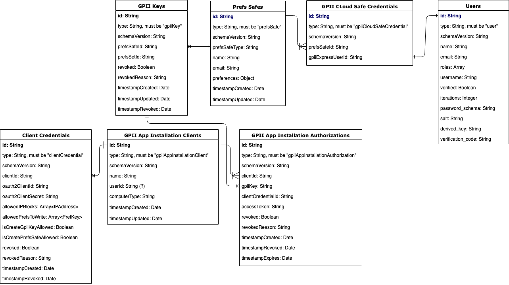

# Data Model

This documentation describes the current data model used by the Personal Data
Service.  It is based on the data model used in the [GPII project](https://wiki.gpii.net/w/Main_Page).
GPII's data model was implemented using CouchDB but the Personal Data Service
will use PostgresSQL.

Diagrams below are drawn using [Entity Relationship Model](https://en.wikipedia.org/wiki/Entity–relationship_model).
Arrows are used to express cardinality where a single line indicates
"one single", and the crow's foot indicates "one or more". For example, a single
`Prefs Safe` could have one or more `PrefsSafe Keys`, or in other words, one
or more keys can reference to the same preferences safe.

## The Data Model

This data model was in development when the GPII project ended. The goal was to
support the user management feature implemented using [fluid-express-user](https://github.com/fluid-project/fluid-express-user).



## Table Descriptions

### Prefs Safes

- QUESTIONS:
  - Is the `password` field needed, or is the one in the associated `User` record
    sufficient (`User.derived_key`)?  Is the `password` field "optional", and used
   only for the `PrefsSafesKey` access?
  - Similarly, are the `name` and `email` needed?  They are also built into
    `User`s.  Again, only needed for `PrefsSafesKey` access?

| Name             | Type                        | Required? | Default | Description |
| ---              | ---                         | ---       |  ---    | ---         |
| prefsSafesId     | String                      | Required  | None    | Unique ID of this preferences safe. |
| safeType         | enum of ["snapset", "user"] | Required  | "user"  | Indicates whether this preferences safe is allowed to be modified: the ones with "snapset" type are unmodifiable while the ones with "user" type are modifiable. |
| name             | String                      | Optional  | null    | The user defined name for the corresponding preferences safe. A pair of “preference-safe-name and password” can potentially be used as a key. |
| password         | String                      | Optional  | null    | The user defined password for this preferences safe. A “preference-safe-name and password” pair can potentially be used as a key. In the future data model, this field is moved to the "Users" document that holds login information for the user management. |
| email            | String                      | Optional  | null    | The user email. |
| preferences      | Object                      | Required  | null    | The user preferences. Refer to the "More Document Field Examples and Explanations" section for an example of this field. |
| timestampCreated | Date                        | Required  | now()   | The timestamp when the token is created. |
| timestampUpdated | Date                        | Optional  | null    | The timestamp when the token is updated. |

### Users

Table of Records that contains information about users.

| Name              | Type    | Required? | Default | Description |
| ---               | ---     | ---       | ---     | ---         |
| userId            | String  | Required  | None    | The ID of the user record; references a user's Cloud Safe Credentials. |
| name              | String  | Required  | None    | The name of the user. |
| username          | String  | Required  | None    | The user name for login. |
| derived_key       | String  | Required  | None    | The encrypted version of the password for login. |
| verification_code | String  | Required  | None    | The code sent to a user for verifying the email address. |
| salt              | String  | Required  | None    | The securely-generated random bytes that are supplied as an input parameter to [the PBKDF2 algorithm](https://cryptobook.nakov.com/mac-and-key-derivation/pbkdf2) when producing the derived key. |
| iterations        | String  | Required  | None    | The count of iterations that is supplied as an input parameter to [the PBKDF2 algorithm](https://cryptobook.nakov.com/mac-and-key-derivation/pbkdf2) for producing the derived key. |
| email             | String  | Required  | None    | The email provided by the user when signing up a new account. |
| roles             | Array   | Required  | None    | The user roles. Each user can have more than one role. For now, [fluid-express-user](https://github.com/fluid-project/fluid-express-user) only supports the role of "user". |
| verified          | Boolean | Required  | false   | Whether the user has verified their email address. |

Refer to [fluid-express-user](https://github.com/fluid-project/fluid-express-user/blob/master/tests/data/users.json) for
samples of user records in the most up-to-date document structure.

### Cloud Safe Credentials

- QUESTIONS:
  - Should this have a reference to an App Installation Authorization (access
    token) to support SSO?

This table contains information to associate users with their preferences safes

| Name               | Type    | Required? | Default | Description |
| ---                | ---     | ---       | ---     | ---         |
| id                 | String  | Required  | None    | The ID of these cloud safe credentials. |
| prefsSafeId        | String  | Required  | None    | The ID of the preferences safe that is allowed to be accessed by the corresponding user login. |
| userId             | String  | Required  | None    | The user ID that is authorized to access the corresponding preferences safe. |
| timestampCreated   | Date    | Required  | now()   | The timestamp when these credentials were created. |
| timestampUpdated   | Date    | Optional  | null    | The timestamp when these credentials were updated. |
| timestampRevoked   | Date    | Optional  | null    | The timestamp when these credentials were revoked. |

### Client Credentials

| Name               | Type    | Required? | Default | Description |
| ---                | ---     | ---       | ---     | ---         |
| id                 | String  | Required  | None    | The ID of theses client credentials. |
| clientId           | String  | Required  | None    | The App Installation Client that these credentials are for. |
| oauth2ClientId     | String  | Required  | None    | The unique identifier issued to a registered OAuth2 client by the authorization server. |
| oauth2ClientSecret | String  | Required  | None    | Confidential shared secret between the OAuth2 client and the authorization server, used to verify the identity of the OAuth2 client. |
| revoked            | Boolean | Required  | false   | Whether thes client credentials have been revoked. |
| revokedReason      | String  | Optional  | null    | The revoked reason. |
| timestampCreated   | Date    | Required  | now()   | The timestamp when these credentials were created. |
| timestampUpdated   | Date    | Optional  | null    | The timestamp when these credentials were updated. |
| timestampRevoked   | Date    | Optional  | null    | The timestamp when these credentials were revoked. |

### App Installation Clients

- QUESTIONS:
  - Do we want to support `userId or prefsSafesKey`?  Keep for future expansion?
  - Should this be combined with the Cloud Safe Credentials?

| Name                    | Type                                                       | Required? | Default | Description |
| ---                     | ---                                                        | ---       | ---     | ---         |
| clientId                | String                                                     | Required  | None    | The ID of this App Installation client. |
| name                    | String                                                     | Required  | None    | The user provided client name. |
| userId or prefsSafesKey | String                                                     | Optional  | null    | The ID of the `User` or the `PrefsSafes` associated with this client. The intention of this field is to identify the person who manages this client. It's still in question whether this field should record userId or prefsSafeSKey. |
| computerType            | enum of ["public", "private", "shared by trusted parties"] | Required  | None    | Type of computer where this app is installed. |
| timestampCreated        | Date                                                       | Required  | now()   | The timestamp when the token is created. |
| timestampUpdated        | Date                                                       | Optional  | null    | The timestamp when the token is updated. |

### App Installation Authorizations

| Name               | Type    | Required? | Default | Description |
| ---                | ---     | ---       | ---     | ---         |
| tokenId            | String  | Required  | None    | The ID of this authorization token record. |
| clientId           | String  | Required  | None    | The ID of the associated App Installation Client. |
| prefsSafesKey      | String  | Required  | None    | The PrefsSafe key whose access is authorized by this App Installation. |
| clientCredentialId | String  | Required  | None    | The client credential id that is used to request this authorization. |
| accessToken        | String  | Required  | None    | The access token used to retrieve the protected user preferences. |
| revoked            | Boolean | Required  | false   | Whether this authorization has been revoked. |
| revokedReason      | String  | Optional  | null    | The revoked reason. |
| timestampCreated   | Date    | Required  | now()   | The timestamp when the authorization is created. |
| timestampRevoked   | Date    | Optional  | null    | The timestamp when the authorization is revoked. |
| timestampExpires   | Date    | Required  | None    | The timestamp when this authorization expires. |

### PrefsSafes Keys

- QUESTIONS:
  - Do we want to support this?  If not, how are the related tables affect?
  - Related tables

| Name             | Type   | Required? | Default | Description                                  |
| ---              | ---    | ---       | ---     | ---                                          |
| keyId            | String | Required  | None    | The ID of this key, written onto key tokens. |
| prefsSafeId      | String | Optional  | null    | The ID of the preferences safe that this key connects with. Set to null if the key does not have a preferences safe connected. |
| prefsSetId       | String | Optional  | null    | The key of the preferences set in a preferences safe that this key points to. The identifier matches a key within the `prefsSets` block of a preference set. For example, the default prefsSetId is a fixed name "default". |
| revoked          | Boolean| Required  | false   | Whether this key has been revoked.           |
| revokedReason    | String | Optional  | null    | The revoked reason.                          |
| timestampCreated | Date   | Required  | now()   | The timestamp when the token is created.     |
| timestampUpdated | Date   | Optional  | null    | The timestamp when the token is updated.     |
| timestampRevoked | Date   | Optional  | null    | The timestamp when the token is revoked.     |

## Field Examples and Explanations

### prefsSafes.preferences

Object. Required.

- Each preferences set in a preferences safe is keyed by an internally generated
  id. The default preferences set is keyed by a fixed string "default".
- Each preferences set contains a field called "name" that is to save the user
  defined name for this preferences set.

Example:

``` .json
{
    "prefsSets": {
        "default": {
            "name": "Default preferences",   // user defined name
            "preferences": {
                "http://registry.gpii.net/common/highContrastEnabled": true,
                "http://registry.gpii.net/common/highContrastTheme": "white-black",
                "http://registry.gpii.net/common/cursorSize": 0.5
            },
            "metadata": [
                {
                    "type": "required",
                    "scope": [
                        "http://registry.gpii.net/common/screenReaderTTSEnabled"
                    ],
                    "value": 1024
                },
                {
                    "type": "priority",
                    "scope": [
                        "http://registry.gpii.net/applications/com.freedomScientific.jaws"
                    ],
                    "value": 1024
                }
            ]
        },
        "internalID-1": {
            "name": "subway",   // user defined name
            "preferences": {
                "http://registry.gpii.net/common/highContrastEnabled": true,
                "http://registry.gpii.net/common/highContrastTheme": "white-black",
                "http://registry.gpii.net/common/cursorSize": 0.5
            },
            "metadata": [
                {
                    "type": "required",
                    "scope": [
                        "http://registry.gpii.net/common/screenReaderTTSEnabled"
                    ],
                    "value": 1024
                },
                {
                    "type": "priority",
                    "scope": [
                        "http://registry.gpii.net/applications/com.freedomScientific.jaws"
                    ],
                    "value": 1024
                }
            ],
            "conditions": [
                {
                    "type": "http://registry.gpii.net/conditions/inRange",
                    "min": 400,
                    "inputPath": "http://registry\\.gpii\\.net/common/environment/illuminance"
                }
            ]
        }
    }
}
```

### clientCredentials

This table contains all OAuth2 client credentials assigned to all OAuth clients, including: 1. App installation clients;
2. Privileged prefs creator clients; 3. Web prefs consumer clients.

- At any time, each client should only have one active un-revoked client
  credential in this document.
- TODO: there's an ongoing discussion on whether to stop support privileged
  prefs creator clients and web prefs consumer clients.

``` .json
{
    "id": "clientCredential-1",
    "clientId": "appInstallationClient-1",
    "oauth2ClientId": "<random string of characters>",
    "oauth2ClientSecret": "<random string of characters>",
    "revoked": false,
    "revokedReason": null,
    "timestampCreated": "2017-11-21T18:11:22.101Z",
    "timestampRevoked": null
}
```

## TODO list

- Update the diagram to match the tabular descriptions.
